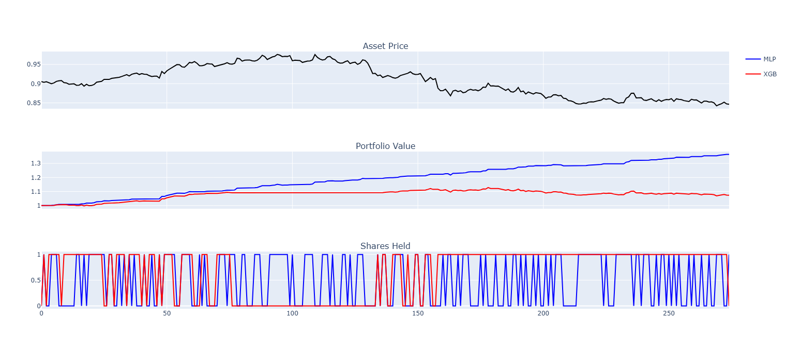

## Combining ML and dynamic programming for trading

The script fits various simple models to predict stock prices.
Rather than predicting the price directly, dynamic programming is used to find the optimal times
to buy/sell stocks for a given spread between buy and sell price, then an ML model predicts the optimal action
from the simple action space (hold 0 shares, hold 1 share) each day.

The performance is surprisingly good for the USD/EUR ForEx example in the script,
possibly because the price generally reverts to the mean throughout the train and test data.

Many further improvements could be made:
- more sophisticated models
- more features
- bigger action space

